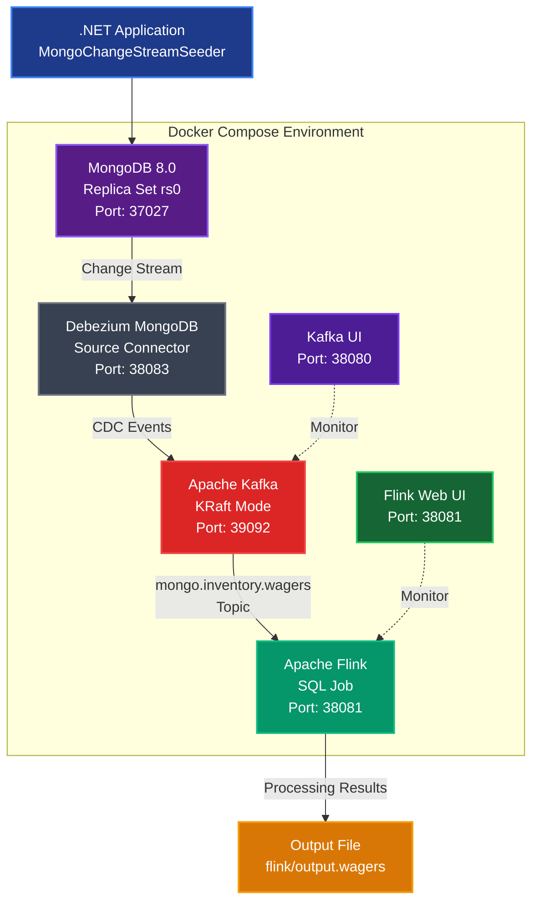

# MongoDB → Kafka → Flink CDC Proof of Concept

This proof of concept project connects MongoDB change streams to Kafka through Debezium and uses Apache Flink to consume events for real-time wager analytics. Docker Compose deploys all required services along with UI interfaces for MongoDB, Kafka, and Flink. A small .NET console application generates wager domain events in MongoDB to drive the end-to-end process.

## Architecture Design

### Mermaid Flow Chart



## Components and Ports

| Service            | Port  | Description                                             |
|--------------------|-------|---------------------------------------------------------|
| MongoDB            | 37027 | MongoDB 8.0 replica set `rs0`, with `inventory.wagers` collection |
| Kafka (PLAINTEXT)  | 39092 | KRaft mode broker                                       |
| Kafka Connect REST | 38083 | Debezium MongoDB source connector                       |
| Kafka UI           | 38080 | provectuslabs/kafka-ui                                  |
| Flink Web UI       | 38081 | JobManager dashboard                                    |

All ports are carefully chosen to reduce the likelihood of conflicts with other local services.

**Note**: The required Kafka topic `mongo.inventory.wagers` is automatically created during Docker Compose startup via the `kafka-topic-init` service.

## Environment Requirements

- Docker Desktop (or compatible Docker + Compose v2)
- .NET 9 SDK (for data seeding console application)
- MongoDB Compass or your preferred MongoDB GUI (optional; not configured here)

## Quick Start

1. **Build and start the stack**
   ```sh
   docker compose build
   docker compose up -d
   ```
   Wait until `docker compose ps` shows container status as `running`/`healthy`.

   During startup, the `kafka-topic-init` service automatically creates the `mongo.inventory.wagers` topic required for the CDC pipeline.

2. **Register MongoDB change stream connector**
   ```sh
   ./scripts/register-mongo-connector.sh
   ```
   PowerShell alternative:
   ```powershell
   ./scripts/register-mongo-connector.ps1
   ```
   You should receive a JSON response confirming connector creation. Debezium will snapshot the existing `inventory.products` collection and then stream new events.

3. **Submit Flink SQL job**
   ```sh
   ./scripts/submit-flink-sql.sh
   ```
   PowerShell alternative:
   ```powershell
   ./scripts/submit-flink-sql.ps1
   ```
   This registers a continuous query that reads the `mongo.inventory.wagers` topic and outputs processed wager analytics to both `print` connector (visible through container logs) and filesystem. The Flink Web UI at <http://localhost:38081> will show job and throughput details.

4. **Seed MongoDB data via .NET**
   ```powershell
   dotnet run --project src/MongoChangeStreamSeeder
   ```
   The seeder now generates 10 wagers per run, prints each document, and reports how many were confirmed, canceled, or left pending. Only wagers with a non-null `endTime` reach Kafka because the Debezium connector filters partial records.
   Optionally provide a SKU prefix: `dotnet run --project src/MongoChangeStreamSeeder DemoSKU`.

5. **Observe data flow**
   - Kafka UI: <http://localhost:38080> — Check the `mongo.inventory.wagers` topic to see raw wager change events.
   - Flink UI: <http://localhost:38081> — Open the running job to see metrics like processed wager count.
   - Processed wager analytics are output to the `flink/output.wagers` directory as JSON files with calculated platform revenue metrics.
   - Can also observe real-time processing through TaskManager logs:
     ```sh
     docker compose logs -f flink-taskmanager
     ```

## Debezium Connector Filtering

- The Debezium connector (`debezium/mongodb-source.json`) sets both `snapshot.aggregate.pipeline` and `cursor.pipeline` so only wagers with `endTime` populated are published to Kafka.
- After editing the file, reapply the settings with:
  ```powershell
  Invoke-WebRequest -Uri 'http://localhost:38083/connectors/mongo-wagers/config' -Method Put -ContentType 'application/json' -InFile 'debezium/mongodb-source-config.json'
  ```
  or use the `register-mongo-connector` scripts to update the running connector.
- Historical Kafka messages created before the filter remain; start consumers with a new group or purge the topic if you need a clean stream.

## Connection Details

- **MongoDB connection string:** `mongodb://localhost:37027/?replicaSet=rs0`
- **Kafka bootstrap (internal):** `kafka:29092`
- **Kafka topic:** `mongo.inventory.wagers` (automatically created by `kafka-topic-init` service)

The MongoDB replica set is automatically initialized (`mongo/init-replica.js`). The `inventory.wagers` collection is created when the first wager is inserted. The required Kafka topic is pre-created during Docker Compose startup to ensure Flink jobs can start successfully.

## Cleanup

```sh
docker compose down -v
```
Removes containers, networks and volumes to start fresh.

## Troubleshooting

- Ensure MongoDB replica set reports `PRIMARY` status before registering connector: `docker compose logs mongodb`.
- Debezium connector status can be queried at `GET http://localhost:38083/connectors/mongo-wagers/status`.
- If Flink job fails due to missing Kafka connector, rebuild via `docker compose build --no-cache flink-jobmanager` to ensure Kafka SQL connector jar is downloaded correctly.

## Future Ideas

- Add dedicated Flink sinks (e.g., Elasticsearch or WebSocket) for real-time wager analytics dashboards.
- Extend the .NET application as a Web API to simulate live gaming sessions with real-time wager events.
- Add automated integration tests using Testcontainers in .NET to spin up the stack.
- Implement complex event processing (CEP) patterns to detect suspicious betting behavior.
- Add time-windowed aggregations for real-time platform revenue monitoring.